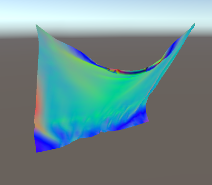
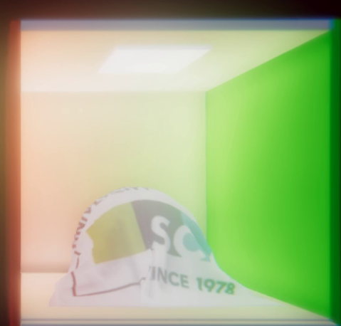

# GPU Cloth Simulation

This repository is about GPU based Mass-Spring Simuation in Unity. Based upon Compute Shader, calculates physics in parallel.  

This project is a sub project of ReclothSimulation-master, a private repository, some of features are removed in this repo.  

- Mass Spring System Cloth
- ~~Inter Object Collision-Response~~
- ~~Self Collision-Response~~
- ~~Dynamic Collider Generation~~

Currently Confirmed working on following platforms:

- Unity Engine version 5.6.1f2 ~ 2018.2.0b10
- Windows(OpenGL Core)
- Android(OpenGL Core)

## How to use

Create a empty GameObject on hierarchy panel and append [ClothSimuation](https://github.com/JUSTIVE/GPU-Cloth-Simulation/blob/master/Assets/GPUClothModule/script/ClothSimulation.cs) and [ClothRenderer](https://github.com/JUSTIVE/GPU-Cloth-Simulation/blob/master/Assets/GPUClothModule/script/ClothRenderer.cs) scripts on it. Since this simulation calculates with its own system, you'll need special materials and dedicated shaders for rendering. There are two example materials(Face Normal Rendering, Diffuse Rendering).

### Attributes

#### Cloth Simulation

##### Compute Shaders

attributes|description
:---|:---
NodeUpdateComputeShader| a compute shader which updates forces, positions, velocities, etc.
TriCollisionResponseComputeShader| a compute shader which calculates collision with floor
NormalComputeShader| a compute shader which calculates all face normals of the cloth model

##### Attribute of Cloth

attributes|description
:---|:---
VertexColumn|numbers of nodes in a Column
VertexRow|numbers of nodes in a Row
ClothSize|Size of cloth object in Unity world scale
ClothMass|Mass of cloth object
Looper|amount of looping compute shaders per frame, larger number for precise, slower simulation

##### Constant for Cloth

attributes|description
---|---
SpringK|spring force from [Hooke's Law](https://en.wikipedia.org/wiki/Hooke%27s_law)
Damping|damping coefficient for cloth simulation
External Force|external forces such as wind, water etc. since it is public member, you can pass from external scripts

#### Cloth Renderer

attributes|description
---|---
Mat|a material for Cloth Object.
LightGameObject|a light-type Gameobject, especially for diffuse rendering. Directional light recommended.
MeshTopology|which element to draw Cloth: currently triangles supported, but you can write your own shader for others.

### Caveats

Since the simulation is not pretty stable, certain values for the clothSimulation scripts are recommended:

#### recommended parameters of Attribute of Cloth

attributes|values
---|---
vertexColumn|8 ~ 64
vertexRow|8 ~ 64
Looper|20 ~ 500, larger values for more stable simulation

#### recommended parameters of Constant of Cloth

attributes|values
---|---
SpringK|10000~ 50000, but for a non-elastic behaving typical cloth, values around 35000 is recommeded
Damping|100~200, can be vary by SpringK

#### recommended parameters of Cloth Renderer

attributes|values
---|---
Mat|requires custom shaders, look at the [normalShader](https://github.com/JUSTIVE/GPU-Cloth-Simulation/blob/master/Assets/GPUClothModule/shader/render/NormalShader.shader) and [DifwithShadows](https://github.com/JUSTIVE/GPU-Cloth-Simulation/blob/master/Assets/GPUClothModule/shader/render/DifWithShadows.shader) in [shader->render](https://github.com/JUSTIVE/GPU-Cloth-Simulation/tree/master/Assets/GPUClothModule/shader/render)  directory.
LightGameObject|Directional Light is highly recommended
MeshTopology|You can use all of MeshTopology types, but you should write your own shaders. The embedded two shaders use MeshTopology.Triangles.

## Contact

you can contact Minsang Kim via e-mail(ben399399@gmail.com).

## License

This Project is licensed under the [MIT License](https://opensource.org/licenses/MIT)

Copyright (c) 2018 Minsang Kim

Permission is hereby granted, free of charge, to any person obtaining a copy
of this software and associated documentation files (the "Software"), to deal
in the Software without restriction, including without limitation the rights
to use, copy, modify, merge, publish, distribute, sublicense, and/or sell
copies of the Software, and to permit persons to whom the Software is
furnished to do so, subject to the following conditions:

The above copyright notice and this permission notice shall be included in all
copies or substantial portions of the Software.

THE SOFTWARE IS PROVIDED "AS IS", WITHOUT WARRANTY OF ANY KIND, EXPRESS OR
IMPLIED, INCLUDING BUT NOT LIMITED TO THE WARRANTIES OF MERCHANTABILITY,
FITNESS FOR A PARTICULAR PURPOSE AND NONINFRINGEMENT. IN NO EVENT SHALL THE
AUTHORS OR COPYRIGHT HOLDERS BE LIABLE FOR ANY CLAIM, DAMAGES OR OTHER
LIABILITY, WHETHER IN AN ACTION OF CONTRACT, TORT OR OTHERWISE, ARISING FROM,
OUT OF OR IN CONNECTION WITH THE SOFTWARE OR THE USE OR OTHER DEALINGS IN THE
SOFTWARE.

## Acknowledge

This work was supported by the National Research Foundation of Korea(NRF) grant funded by the Korea government(Ministry of Science, ICT & Future Planning) (No. 2017R1A2B1005207).
